# 同步容器ConcurrentLinkedQueue

JDK提供了一系列线程安全的容器，在多线程的环境中可以提供稳定的操作。这里说一下线程安全的队列中的ConcurrentLinkedQueue。

对于普通的队列Queue提供以下基本操作。

```
Queue
#入队成功返回true，否则抛异常
boolean add(E e);
#入队成功返回true，失败返回false
boolean offer(E e);
#出队，队列空时抛异常
E remove();
#出队，空时返回null
E poll();
#返回头节点，但是不出队，空时抛异常
E element();
#返回头节点，但是不出队，空时返回null
E peek();
```

这里我们主要分析一下入队和出队操作，探索一下ConcurrentLinkedQueue是怎么高效的保证线程安全的。

ConcurrentLinkedQueue首先是个链表。在链表的基础上实现了队列的功能。

## 入队

首先先看一下入队的代码。

```
public boolean offer(E e) {
    checkNotNull(e);
    final Node<E> newNode = new Node<E>(e);
    for (Node<E> t = tail, p = t;;) {
        Node<E> q = p.next;
        //(1)
        if (q == null) { 
            if (p.casNext(null, newNode)) {
                if (p != t)
                    casTail(t, newNode);
                return true;
            }
        }
        //(2)有其他出队的线程时，需要将p设置到head节点
        else if (p == q)
            p = (t != (t = tail)) ? t : head;
        //(3)
        else
            p = (p != t && t != (t = tail)) ? t : q;
    }
}
```

根据名字可以看到ConcurrentLinkedQueue会采用CAS的方式设置下一个节点以及tail节点。

初始状态，head和tail同时指向一个节点，没有内容

```
public ConcurrentLinkedQueue() {
	head = tail = new Node<E>(null);
}
```

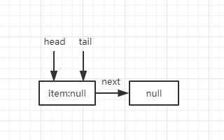

### 单线程入队

我们先讨论单线程的情况下ConcurrentLinkedQueue的基础入队情况

**第一次入队**

- 会进入条件（1）
- 单线程无线程竞争，p cas设置next会设置成功
- p==t，不设置tail，返回true

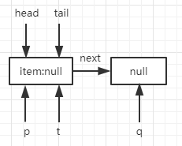

然后队列就变成了如下状态

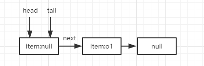

**第二次入队**

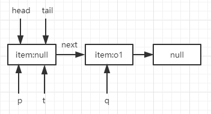

- q!=null ，q!=p 进入条件（3）
- p==t，所以p=q

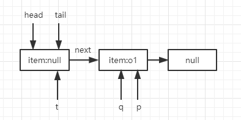

进入下一次循环，q指向p的next节点

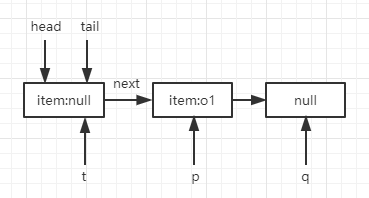

- q==null，进入条件1
- cas设置next节点
- p!=t，设置tail节点

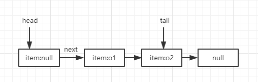

第三次入队就和第一次入队一样，也就是，奇数次的入队和偶数次的入队逻辑保持一致。

- 奇数次入队时，tail并不是最后一个节点，是倒数第二个节点
- 偶数次入队时，tail是最后一个节点

### 多线程入队

多线程入队情况会更加复杂，要考虑到线程争夺，以及线程中断，取消的可能性。

初始状态仍然是


当两个线程竞争，同时入队时，也就是同时调用casNext时，有一个会成功，一个会失败

成功的线程正常入队，下面看一下失败的线程，失败的线程会进入下一次循环

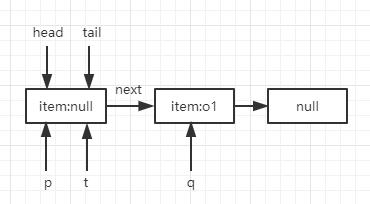

- q!=null,q!=p，因此进入条件（3）
- p==t所以p=q,进入下一次循环
- 失败线程的第二次循环和单线程的第二次入队基本一致。

**如果存在第三个线程**，第二次casNext竞争失败，在第三个线程的下一次循环中已经存在2个元素入队了

线程3在第二次cas开始的状态

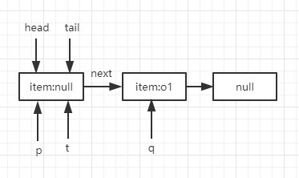

cas竞争失败，进入下一个循环，p==t

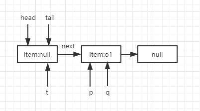

在进入下一个循环，当线程二入队成功

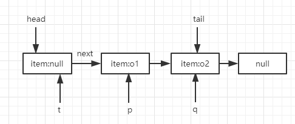

此时q!=null,p!=t且t != (t = tail)

> t != (t = tail) 的执行会让人产生困惑，左侧的t一直都是被赋值之前的t，右侧的t是赋值之后的t，因此比较新旧tail节点，当前情况显然不等

测试t=tail，p=t

进入下一次循环q=p.next

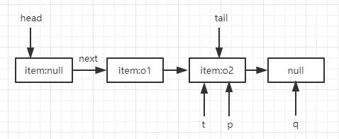

就可以继续正常入队了

**当其他线程执行出队，下一个线程执行入队时，会触发条件（2）**

当一个线程刚完成出队，并且队列为空时，tail的节点将指向自己，此时线程准备执行入队时，p、t、q将同时指向tail，此时p==q，进入条件2

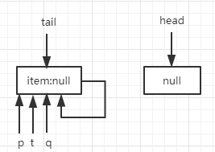

根据条件2内部，代码，p将指向head

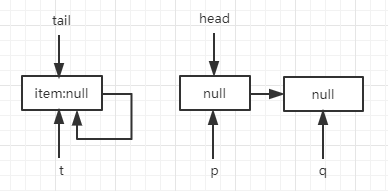

此时q==null，执行入对操作。

在多线程环境中，存在很多不确定的可能性，比如哪个线程先完成cas，哪个线程先进入下一个循环条件，那个线程cas失败多次依然在获取，哪个线程在线程出现异常情况其它线程依然可以正常入队，各个线程竞争设置尾节点失败的话为什么还会得到最终正确的尾节点。读懂上面的分析将得出结论。

### 出队

先看代码

```
public E poll() {
    restartFromHead:
    for (;;) {
        for (Node<E> h = head, p = h, q;;) {
            E item = p.item;
            //（1）
            if (item != null && p.casItem(item, null)) {
                if (p != h)
                    updateHead(h, ((q = p.next) != null) ? q : p);
                return item;
            }
            //（2）
            else if ((q = p.next) == null) {
                updateHead(h, p);
                return null;
            }
            //（3）
            else if (p == q)
                continue restartFromHead;
            //（4）    
            else
                p = q;
        }
    }
}
```

先看一下无竞争环境下的基本出队操作

队列中存在一个元素

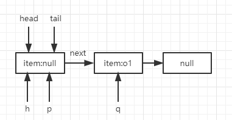

进入条件4

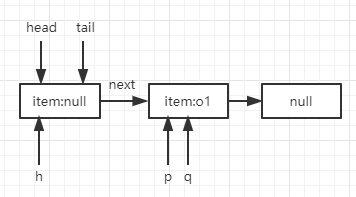

然后进入条件1

- 将p节点内item设置为null
- q=p.next
- head==h的话，将head设置为p
- h将next设置为h

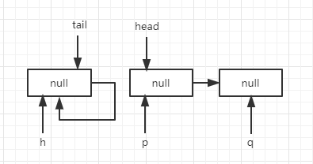

出队完成。

**多线程出队**

在条件1的casItem中存在竞态条件，存在失败的情况

当队列只有一个数据节点时，线程1，2同时出队，只有一个可以成功

失败线程在进入下一次循环时，线程1已经把节点移除，此时线程2下一个循环的状态

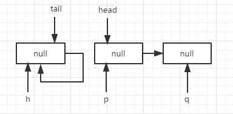

进入条件2，返回null。

还有一种情况，线程1，2同时出队，线程1进入updateHead前，此时线程2出队

然后线程1updateHead,将原head节点的next指向自己

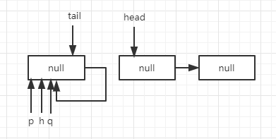

就会出现条件（2）的状态，此时会跳出到大循环外面重新执行。

## 总结

ConcurrentLinkedQueue时Java中无锁队列的实现。无锁队列看似代码简单，实则是一个非常复杂的保证多线程同时出队，入队不会出现线程安全问题的高效无锁队列算法。值得研究。


