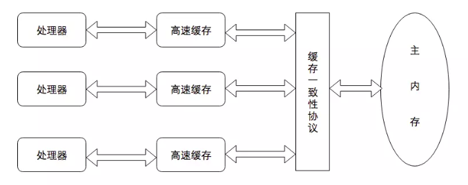

#  Java内存模型

在Java虚拟机规范中规定着Java的内存模型来达到消除不同操作系统间差别的目的

## 主内存和工作内存

Java的内存模型的主要目标时定义程序中各个变量的访问规则，即把变量存储到内存和从内存中取出来的规则。

- 变量：实例字段，静态变量，数组中的元素
- 局部变量：方法内定义的变量，也就是栈内的变量，线程私有

Java的内存模型规定所有的变量(非局部变量，下同)都存在主内存中，对应物理内存，对应Java堆的对象实例部分。

每个线程有自己的工作内存，对应CPU高速缓存，寄存器，对应着虚拟机栈的部分区域。

内存模型分为主内存和工作内存的目的是因为高速缓存的速度远胜于主内存，这么分布可以大大提升程序运行速度。

工作内存保存着需要使用的变量的主内存中的副本，线程对变量操作都在工作内存中，不同的工作内存互相隔离，无法互相范围。也就是说一个变量可能在多个线程中有多个副本。每个线程各自操作，这也是产生线程安全问题的主要原因。

## 内存间交互

主内存和工作内存数据交换有交互协议，定义数据交换的规则。可以大致定义三种行为：锁定操作，内存间的读写和工作内存和执行引擎的交互。

- 主内存数据锁定/解锁，是主内存变量让一个线程独占
  - lock，unlock

- 从主内存读取数据，read和load必须同时出现（不一定连续）
  - read：主内存操作，把变量从主内存传输到工作内存
  - load：工作内存操作，接受变量，放到工作副本

- 与上面相反，从工作内存写入主内存，store和write也必须同时出现
  - store：工作内存操作，把变量从工作内存传输到主内存
  - write：主内存操作，接受变量，放到主内存对应的变量

- 与执行引擎的交互，工作内存操作，只有工作内存才会和CPU直接交互
  - use：将工作内存变量的值传递给执行引擎
  - assign：执行引擎将值赋给变量

还定义了一些规则来约束其行为

- 线程中的变量**只有**发生了assign操作后，**才能且必须**同步回主内存
- 新的变量只能在主内存初始化
- 一个变量在同一时刻只能被一个线程锁定
- 执行lock时，工作内存的对应的值被清空，需要重新assign或load
- 线程没有lock一个变量，不能unlock
- 在unlock之前必须变量同步回主内存

通过这些约束能够确定哪些操作时线程安全的、

## 先行发生原则

在Java内存模型中存在者原生支持的先行发生关系,也就是当一个操作在时间上早于另一个操作，二者能保证先后顺序，不会发生重排序

- **程序次序规则**：在一个线程内，按照代码顺序执行
- **管程锁定规则**：unlock先行发生于用一个锁的lock，先解锁再加锁
- **volatile变量规则**：先执行写操作，在执行读操作，能保证执行顺序
- **线程启动规则**：线程的start()先于线程所有操作
- **线程终止规则**：线程的所有操作先于线程终止操作（join）
- **线程中断规则**：interrupt()操作先于中断操作检测interrupted()

## 原子性，有序性和可见性

**原子性**

在Java内存模型中read,load,assign,use,store,write是原子性的，也就是说基本数据类型的读写是原子性的。然后就是通过synchronized同步块来保持原子性

**可见性**

当一个线程修改了共享变量的值，其他线程都是可见的

volatile可以保证写操作立即同步到主内存，以及使用时从主内存刷新

final关键字可以保证初始化完成之后其他线程可看到final字段的值

synchronized在unlock之前必须变量同步回主内存，也保证了可见性

**有序性**

volatile禁止重排序提供了有序性

synchronized的解锁和获取锁的先后关系也提供了有序性

还有就是上述的默认的先后规则提供了有序性

