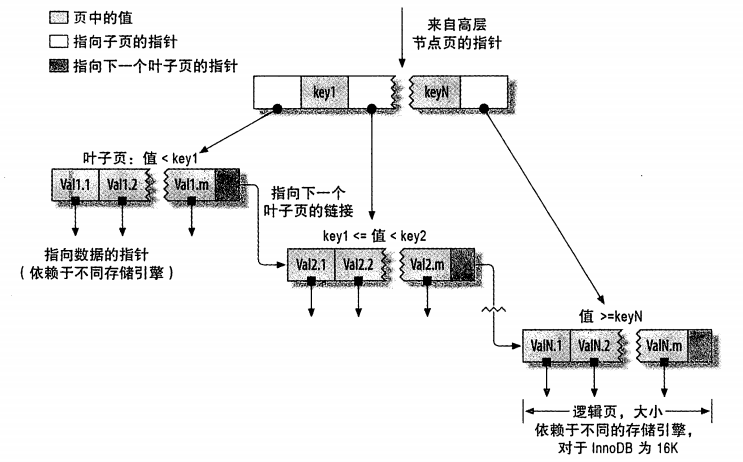
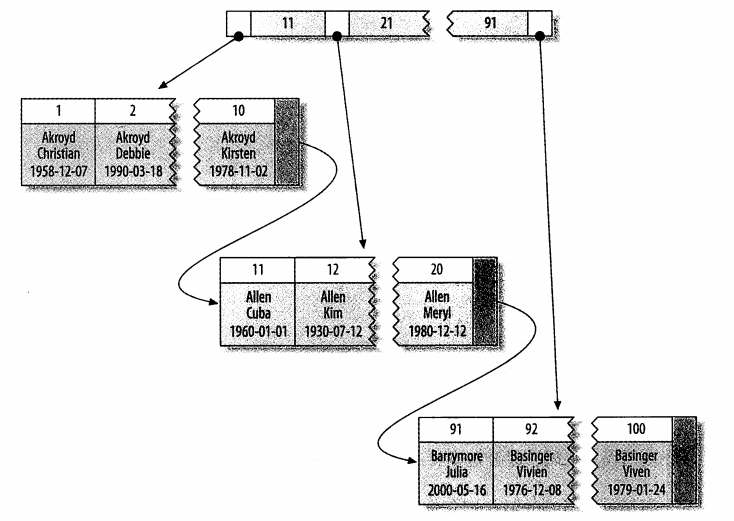
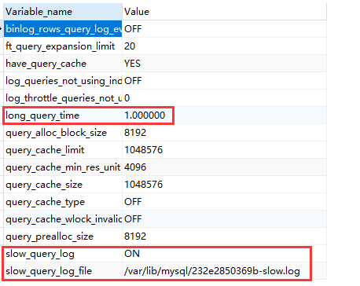

# MySQL中的索引

## 概述

索引是存储引擎用于快速找到记录的一种数据结构

理解索引就像看一本书一样，在目录查找标题，然后找到对应的页码

在MySQL中同样如此，现在索引中找到对应值，然后再根据索引记录找到对应的数据行

索引可以快速的找到表的指定位置，并且可以用于group by和order by操作（B-Tree）

### 索引的类型

#### B-Tree索引

在MySQL中使用的最多的索引类型。各个引擎的实现存在算法的一些变种，比如InnoDB用的是B+Tree。

在InnoDB中，数据按照原格式存储，并且根据主键引用被索引的行

B-Tree是平衡树的一种算法，被索引的全部字段的数据都是按照顺序存储在各个节点中，每一个叶子到根的距离相同



在使用B-Tree索引进行查找时，是从索引的根节点进行搜索，在根节点中存放了指向子节点指针，在查找的过程中根据比较查找的值和节点的值比较并向下层查找，最终找到结果或不存在。

因为时顺序存储，因此比较适合进行范围查找

B-Tree索引适用的情况有全键值、键值范围或键前缀査找，其中键前缀查找只适用于根据最左前缀的查找。

- 全值匹配：查询和索引完全匹配
- 匹配最左前缀：使用索引的前n列，都可在索引中查询，跳过的话只有之前的列可以使用索引，第一列不用的话就完全没法使用索引
- 匹配列前缀：like ‘%query’
- 匹配范围值：满足索引的列可以按照范围查找
- 精准匹配某一列并范围匹配另一列：左边的精准匹配，后一列范围查询，但是在后面的就没法使用索引了
- 只访问索引的查询：覆盖索引，只需访问索引，即可获得结果

#### Hash索引

基于哈希表实现，只适用于完全匹配。

- 哈希索引只包含哈希值和行指针，不存储字段值
- 不按索引值的顺序存储
- 不支持部分索引列的匹配，因为hash索引时把全部索引字段计算的hash值
- 只支持等值的查找，不支持范围的查找
- 如果Hash冲突很多的话，会获得链表级的查找体验

### 索引策略

#### 选择合适的索引列顺序

通常来说应将选择性高的列放在前面，这样能最快的过滤出需要的行

#### 聚簇索引

聚簇索引是一种数据存储方式，数据行（全部数据）存放在索引的叶子页中

数据行和键值紧凑的存储在一起，因为数据行只能存放在一个地方，所以一个表只能由一个聚簇索引



节点页中仅包含索引列，叶子页中包含全部数据

索引列只支持主键，同时，在InnoDB中创建的有主键列的表，就会创建聚簇索引

如果没有主键列就会选择非空索引，如果还没有，就会创建隐式的主键来作为聚簇索引

聚簇索引“就是”表

每个叶子节点中包含主键值，事务ID，回滚指针和剩余列

##### 优点

- 相关数据保存在一起，当查找一个范围时，读取少量的数据页就可以获取全部数据
- 索引和数据都在B-Tree中，因此获取数据会更快
- 使用覆盖索引的查询可以直接使用叶节点中的主键值

##### 缺点

- 插入速度依赖插入顺序，按照主键的插入顺序是最快的
- 更新索引列代价高，因为会移动位置
- 插入或更新主键时需要移动行，可能导致“页分裂”问题。当一页已满又有新的数据插入时，或分裂成2页，占用更多磁盘空间
- 会导致全表扫描变慢
- 二级索引（非聚簇索引，自建的都是）的叶子节点包含主键列，访问时需要二次查找。也就是先通过索引获取主键值，在使用主键值在聚簇索引中查找对应的行

#### 覆盖索引

MySQL可以使用索引来获取列的数据而无需再读取数据行数据，此时，当索引包含所有查询所需的字段的值，可以被成为覆盖索引


### MySQL慢查询日志

开启慢查询日志

```
set global slow_query_log = on; 
```

设置超时时间

```
set long_query_time = 1;
```

查看慢查询日志配置

```
show variables like '%quer%';
```

查看慢查询日志



```
# Time: 2019-10-02T10:39:02.025153Z
# User@Host: root[root] @  [172.17.0.1]  Id:    35
# Query_time: 18.855323  Lock_time: 0.000091 Rows_sent: 10  Rows_examined: 13370813
SET timestamp=1570012742;
select * from view_log where institution_id = 20 and view_month = 11 and view_day = 20  LIMIT 10;
```

